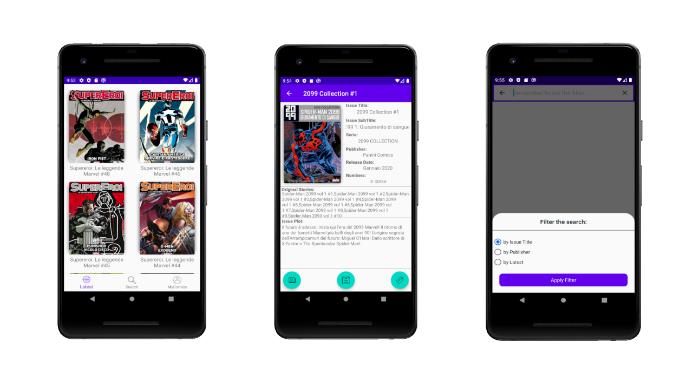

# TheComicsLibrary
TheComicsLibrary is an under development free and open source library for comics and manga for Android 5.0 and above.
 

### How to set up
The app isn't published on PlayStore yet, so you can test it and use locally
1. Run [ComicScraper](https://github.com/FabioPezzini/ComicScraper) to popoulate the local MongoDB and download the covers
2. Setup a REST API that expose the content of the DB as json (using flask for example) 
3. In HomeFragment (app/ui/) insert the endpoint to retrieve the list of comics

NB = If you need some help to install/configure it, just open an Issue

### Roadmap
- [x] Home screen
- [x] Search filter
- [x] Comic page (review - authors & protagonists)
- [ ] MyComics screen
- [ ] Possibility for the user to add extra-info about comics

## Disclaimer
All rights to the contents of the app (names, images, texts and more) are the property of their respective authors and / or publishing houses, under the protection of international copyright / trademark laws.